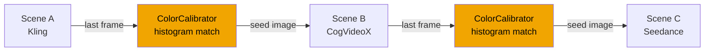

<div align="center">

# 🎬 Forge

**One story, multiple AI models, zero manual stitching.**

[](https://github.com/F-R-L/forge-film/actions)
[](https://www.python.org)
[](LICENSE)
[](https://github.com/F-R-L/forge-film)

[中文文档](README.zh.md) | [Quick Start](#-quickstart)

</div>

---

Making a multi-scene AI film means logging into Kling, CogVideoX, Seedance separately — downloading frames, color-correcting between models, stitching manually. An 8-scene short can eat half a day.

**Forge automates the entire pipeline.** You write a story. Forge compiles it into a scene graph, routes each scene to the right model, runs them in parallel, keeps visual continuity across model boundaries, and outputs a single `final.mp4`.

---

## What Forge does

🧭 **Story → DAG** — GPT-4o (or Claude / DeepSeek) compiles your story into a dependency graph. Scenes with no dependencies run in parallel.

⚡ **CPM parallel scheduling** — Critical Path Method finds the longest dependency chain and prioritizes it. N workers run simultaneously, not one by one.

🎯 **Scene-type routing** — dialogue → Kling, landscapes → CogVideoX (free, local), action → Seedance. Fully configurable in `forge.yaml`.

🎨 **Cross-model continuity** — when scene B (CogVideoX) follows scene A (Kling), Forge extracts A's last frame, applies histogram color matching, and passes it as the i2v seed. No jarring cuts.

🎬 **Streaming assembly** — clips concatenate as each scene finishes. Normalized resolution and frame rate. Outputs `final.mp4`.

---

## Parallel scheduling

```mermaid
gantt
    title Without Forge — 6 scenes × 5 min = 30 min
    dateFormat mm
    axisFormat %M min
    section Sequential
    S1 :s1, 00, 5m
    S2 :s2, after s1, 5m
    S3 :s3, after s2, 5m
    S4 :s4, after s3, 5m
    S5 :s5, after s4, 5m
    S6 :s6, after s5, 5m
```

```mermaid
gantt
    title With Forge (CPM) — critical path = 15 min
    dateFormat mm
    axisFormat %M min
    section Worker 1
    S1 (Kling)     :s1, 00, 5m
    S3 (CogVideoX) :s3, after s1, 5m
    S5 (Seedance)  :s5, after s3, 5m
    section Worker 2
    S2 (Kling)     :s2, 00, 5m
    S4 (CogVideoX) :s4, after s2, 5m
    S6 (Seedance)  :s6, after s4, 5m
```





---

## Cross-model continuity



---

## 🚀 Quickstart

> [!NOTE]
> No API keys? Use `--backend mock` for a full end-to-end run with zero external dependencies.

**Requirements:** Python 3.11+ · ffmpeg · GPU optional (CogVideoX local needs CUDA 12+)

```bash
git clone https://github.com/F-R-L/forge-film
cd forge-film
pip install -e .
cp .env.example .env
```

```bash
# Run with mock backend — no API keys needed
forge run examples/detective.txt --backend mock --workers 4

# Multi-model orchestration
forge run examples/multi_backend_demo.txt --workers 4

# Inspect DAG and routing without generating video
forge plan examples/detective.txt --scenes 6

# Launch Web UI
forge webui
```

**Web UI** — screenshot coming soon. Run `forge webui` to launch the Gradio interface locally.

### As a library

```python
from forge.config import ForgeConfig
from forge.compiler.vision_compiler import VisionCompiler
from forge.scheduler.scheduler import ForgeScheduler

cfg = ForgeConfig("forge.yaml")
compiler = VisionCompiler(cfg.build_llm_provider())
plan = await compiler.compile(story_text, num_scenes=6)

scheduler = ForgeScheduler(plan, generate_fn, num_workers=cfg.workers)
results, failed = await scheduler.run(asset_map, output_dir="./output")
```

---

## ⚙️ Configuration

`forge.yaml` — all fields optional, falls back to environment variables and defaults.

```yaml
llm:
  provider: openai      # openai | anthropic | deepseek
  model: gpt-4o

imagegen:
  provider: mock        # mock | openai | flux

routing:
  dialogue: kling_light     # Kling v1 — lip sync & character consistency
  action: kling_heavy       # Kling v1.5 Pro — motion quality
  landscape: cogvideo       # CogVideoX local — free
  default: mock

scheduler:
  workers: 4
```

```bash
# .env
OPENAI_API_KEY=sk-...
KLING_API_KEY=...
KLING_API_SECRET=...
```

| Key | Options | Default |
|---|---|---|
| `llm.provider` | `openai` \| `anthropic` \| `deepseek` | `openai` |
| `imagegen.provider` | `openai` \| `flux` \| `mock` | `mock` |
| `validator.provider` | `openai` \| `anthropic` \| `mock` | `mock` |
| `routing.dialogue` | any backend name | `kling_light` |
| `routing.landscape` | any backend name | `cogvideo` |
| `scheduler.workers` | int | `4` |

---

## 🆚 How Forge compares

| | Forge | OpusClip Agent | Seedance Multi-shot | FilmAgent |
|---|---|---|---|---|
| Open source | ✅ MIT | ❌ Closed SaaS | ❌ | ✅ Research prototype |
| Local deployment | ✅ | ❌ | ❌ | Partial |
| Multi-model mixing | ✅ | ✅ not configurable | ❌ single model | ❌ 3D virtual space |
| Cross-model color calibration | ✅ | Unknown | N/A | N/A |
| Pluggable backends | ✅ | ❌ | ❌ | ❌ |
| Data privacy | ✅ stays local | ❌ third-party | ❌ | Partial |

---

## 🏗️ Architecture

```
forge.yaml
    │
    ├── VisionCompiler   story → ProductionPlan (scenes + DAG)
    ├── AssetFoundry     reference images per character / location
    ├── ForgeScheduler   CPM critical path · N workers · retries
    │       ├── PipelineRouter    scene_type → kling / cogvideo / seedance
    │       └── ColorCalibrator   last-frame histogram match for i2v
    ├── VLM Validator    optional frame consistency check
    └── StreamAssembler  ffmpeg concat → final.mp4
```

---

## 📁 Project structure

```
forge/
  compiler/      # Story → DAG (LLM-driven)
  providers/     # LLM / ImageGen / VLM abstractions
  scheduler/     # DAG topology + CPM scheduling
  generation/    # Video backend pipelines
  continuity/    # Cross-model color calibration
  assets/        # Reference image generation + cache
  validation/    # VLM frame consistency check
  assembler/     # Streaming video concatenation
  cli.py
  webui/
forge.yaml
examples/
tests/         # 20 tests, no API keys needed
benchmarks/
```

---

## 🗺️ Roadmap

- [x] Multi-model semantic routing by scene type
- [x] Cross-model color calibration (histogram matching)
- [x] Pluggable LLM / ImageGen / VLM providers
- [x] CPM scheduling with backend-aware duration estimates
- [x] forge.yaml unified config
- [x] Gradio Web UI
- [x] CogVideoX local backend
- [ ] Seedance backend
- [ ] Wan 2.x backend
- [ ] GPU-accelerated local video assembly
- [ ] Story template library
- [ ] Real benchmark results with Kling API

---

## 🤝 Contributing

PRs and issues welcome — see [CONTRIBUTING.md](CONTRIBUTING.md).

---

## 📄 License

MIT — see [LICENSE](LICENSE)
