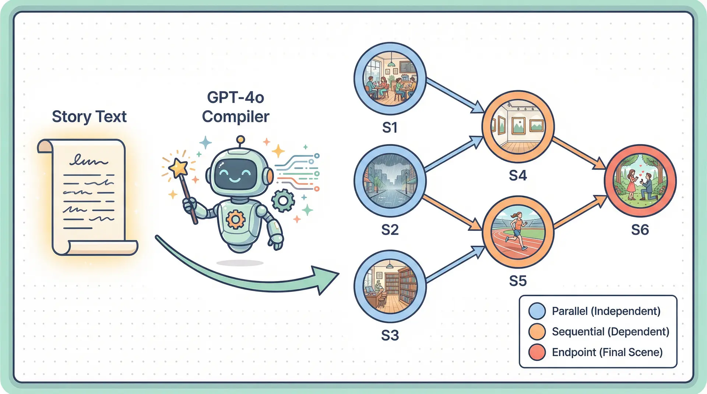
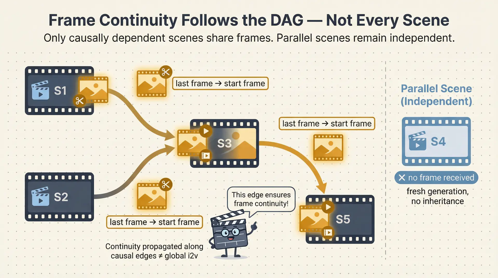

<div align="center">

# 🎬 Forge

**Today's AI films are generated one scene at a time. Forge runs them all at once.**

今天所有的 AI 影视系统都在逐场景串行生成。Forge 把叙事依赖建模为 DAG，用关键路径算法驱动并行调度——同样的故事，场景越独立，生成越快。

[](https://github.com/F-R-L/forge-film/actions)
[](https://www.python.org)
[](LICENSE)
[](https://github.com/F-R-L/forge-film)

[English](#-why-forge) | [快速开始](#-quickstart--快速开始)

</div>

---

## ⚡ Why Forge? | 为什么选 Forge？

Every existing AI film system — FilmAgent, MovieAgent, CoAgent — generates scenes **serially**: scene 2 waits for scene 1, scene 3 waits for scene 2. The total wait time is the sum of every scene.

现有的所有 AI 影视系统——FilmAgent、MovieAgent、CoAgent——全部**串行**生成：第2场等第1场，第3场等第2场，总等待时间是每个场景时间之和。

Forge's core contribution is applying **Critical Path Method (CPM) scheduling** to AI video generation — a scheduling discipline used in construction and manufacturing for decades, never before applied to multi-scene film generation.

Forge 的核心贡献是将**关键路径法（CPM）调度**应用于 AI 视频生成——这是建筑和制造业沿用数十年的调度方法，从未被用于多场景影片生成。

1. **Story → DAG**: GPT-4o compiles your story into a Directed Acyclic Graph of scenes, identifying causal dependencies (a character entering a room must precede them sitting down) vs. truly parallel scenes (two simultaneous storylines).
2. **CPM Priority Scheduling**: Critical Path Method computes the longest dependency chain. Scenes that block the most downstream work are dispatched first — minimizing total wall time, not just maximizing parallelism.
3. **Parallel Workers**: Scenes with no pending dependencies run simultaneously across N workers.
4. **DAG-Aware Frame Continuity**: When scene B depends on scene A in the DAG, Forge automatically extracts A's last frame and passes it as B's i2v starting image — continuity is propagated along causal edges, not applied globally. Parallel scenes remain independent.

1. **故事 → DAG**：GPT-4o 将故事编译为场景有向无环图，识别因果依赖（角色走进房间必须先于坐下）与真正并行的场景（两条同时推进的故事线）。
2. **CPM 优先级调度**：关键路径算法计算最长依赖链，阻塞最多下游工作的场景优先执行——目标是最小化总挂钟时间，而不仅仅是最大化并行度。
3. **并行 Worker**：无待定依赖的场景跨 N 个 Worker 同时执行。
4. **DAG 感知的帧连续性传播**：当场景 B 在 DAG 中依赖场景 A 时，Forge 自动提取 A 的最后一帧并作为 B 的 i2v 起始图像——连续性沿因果边传播，而非全局应用。并行场景保持各自独立。


> Speedup scales with scene independence in your story's DAG. A story with 3 fully independent branches runs in ⅓ the time.
>
> 加速比随故事 DAG 中场景的独立程度线性增长。3条完全独立分支的故事，生成时间缩短至 ⅓。

---

## 🚀 Quickstart | 快速开始

```bash
pip install forge-film
cp .env.example .env        # fill in your API keys / 填入 API Key
forge run examples/detective.txt --backend mock --workers 4
```

### Install from source | 源码安装

```bash
git clone https://github.com/F-R-L/forge-film
cd forge-film
pip install -e .
```

### Try it now (no API key needed) | 立即体验（无需 API Key）

```bash
# Run with mock backend — simulates parallel scheduling without calling any API
# 使用 mock 后端运行——模拟并行调度，不调用任何 API
forge run examples/detective.txt --backend mock --workers 4

# Preview the DAG structure of your story
# 预览故事的 DAG 结构
forge plan examples/romance.txt --scenes 6

# Benchmark parallel vs serial speedup
# 测试并行 vs 串行加速比
forge benchmark --scenes 8 --workers 4
```

---

## 🏗️ Architecture | 系统架构

```
 Story Text  /  故事文本
      │
      ▼
┌──────────────────────┐
│    Vision Compiler   │  GPT-4o → ProductionPlan
│    视觉编译器         │  故事 → 结构化场景 + 有向无环图
└──────────┬───────────┘
           │  {scenes[], assets[], dag{}}
           ▼
┌──────────────────────┐
│    Asset Foundry     │  Parallel reference image generation
│    资产铸造厂         │  并行参考图生成 + 磁盘缓存
└──────────┬───────────┘
           │  {asset_id: Asset}
           ▼
┌──────────────────────────────────────────────┐
│             Forge Scheduler                  │
│             关键路径调度器                    │
│                                              │
│  CPM: compute critical path remaining        │
│  CPM: 计算各节点关键路径剩余时间              │
│                                              │
│  Priority heap → dispatch by urgency         │
│  优先队列 → 按紧迫度分发                      │
│                                              │
│  ┌──────────┬──────────┬──────────────────┐  │
│  │ Worker 1 │ Worker 2 │    Worker N ...  │  │
│  │  [S1]    │  [S3]    │    [S5]         │  │
│  └──────────┴──────────┴──────────────────┘  │
│                                              │
│  on_complete: extract last frame → i2v input │
│  完成后：提取最后帧 → 传给下游场景作为起始帧  │
└──────────┬───────────────────────────────────┘
           │  {scene_id: video_path}
           ▼
┌──────────────────────┐
│   Stream Assembler   │  Streaming moviepy concatenation
│   流式拼接器          │  场景完成即拼接，无需全部等待
└──────────┬───────────┘
           │
           ▼
        final.mp4
```



### DAG Validator | DAG 验证器

Before scheduling, Forge statically validates the compiled DAG:
在调度前，Forge 对编译出的 DAG 进行静态校验：

| Rule | 规则 | Action | 处理 |
|------|------|--------|------|
| Unknown node reference | 引用不存在的场景ID | Error | 报错 |
| Cycle detection | 环路检测 | Error | 报错 |
| Self-loop | 自环 | Auto-fix | 自动修复 |
| Missing continuity edge | 缺失的连续性边（同角色运动场景） | Auto-fix + Warn | 自动补边 + 警告 |
| Isolated interior node | 孤立的中间节点 | Warn | 警告 |



---

## 🧩 Key Modules | 核心模块

| Module | Description | 描述 |
|--------|-------------|------|
| `forge/compiler/vision_compiler.py` | GPT-4o compiles story → ProductionPlan | 故事编译为结构化生产计划 |
| `forge/compiler/schema.py` | Scene, Asset, ProductionPlan data models | 核心数据模型定义 |
| `forge/scheduler/dag.py` | Kahn topological sort + cycle detection | Kahn 拓扑排序 + 环检测 |
| `forge/scheduler/cpm.py` | Critical Path Method forward/backward pass | 关键路径前向后向传递 |
| `forge/scheduler/scheduler.py` | Async CPM priority-queue dispatcher | 异步关键路径优先调度器 |
| `forge/scheduler/dag_validator.py` | Static DAG validation + auto-fix | 静态 DAG 校验 + 自动修复 |
| `forge/assets/foundry.py` | Parallel asset generation with disk cache | 并行资产生成 + 磁盘缓存 |
| `forge/generation/router.py` | Route scenes to light/medium/heavy pipeline | 按复杂度路由到对应生成管线 |
| `forge/generation/` | Mock / Kling light / Kling heavy pipelines | 视频生成管线（mock/轻量/重量） |
| `forge/validation/vlm_validator.py` | GPT-4o Vision consistency checker + retry | 视觉一致性验证 + 自动重试 |
| `forge/generation/cogvideo_pipeline.py` | CogVideoX local t2v/i2v, no API key needed | 本地 CogVideoX 推理，无需 API Key |
| `forge/webui/app.py` | Gradio Web UI with DAG visualization | Gradio Web 界面，含 DAG 可视化 |

---

## 🖥️ CLI Commands | 命令行

### `forge run` — Generate a film | 生成影片

```
forge run STORY_FILE [OPTIONS]

Options:
  --scenes     INTEGER  Number of scenes to generate    [default: 6]
  --workers    INTEGER  Parallel worker count            [default: 4]
  --backend    TEXT     mock | kling | cogvideo         [default: mock]
  --output     PATH     Output directory                [default: ./output]
  --no-validate         Skip VLM validation
```

**Example | 示例**

```bash
# Mock backend (no API key) — test scheduling logic
# Mock 后端（无需 API Key）——测试调度逻辑
forge run examples/detective.txt --backend mock --workers 4

# CogVideoX local backend — no API key, runs on GPU/CPU
# CogVideoX 本地后端——无需 API Key，在本地 GPU/CPU 上运行
pip install forge-film[local]
forge run examples/romance.txt --backend cogvideo --workers 2

# Kling cloud backend — real video generation
# Kling 云端后端——真实视频生成
forge run examples/romance.txt --backend kling --workers 2 --scenes 8
```

### `forge webui` — Launch Web UI | 启动 Web 界面

```bash
# Launch Gradio UI at http://localhost:7860
forge webui

# Public share link (useful for remote servers)
forge webui --share
```

### `forge plan` — Preview DAG | 预览 DAG

```bash
# Compile story and print DAG — no video generation
# 编译故事并打印 DAG——不生成视频
forge plan examples/romance.txt --scenes 6
```

### `forge benchmark` — Measure speedup | 测速对比

```bash
# Compare parallel vs serial execution time
# 对比并行 vs 串行执行时间
forge benchmark --scenes 8 --workers 4
```


---

## 🌍 Environment Variables | 环境变量

Copy `.env.example` to `.env` and fill in your keys.
复制 `.env.example` 为 `.env` 并填入你的 Key。

| Variable | Required | Description | 说明 |
|----------|----------|-------------|------|
| `OPENAI_API_KEY` | For `plan` / `kling` | Story compilation & VLM validation | 故事编译和视觉验证 |
| `KLING_API_KEY` | For `kling` backend | Kling video generation | Kling 视频生成 |
| `KLING_API_SECRET` | For `kling` backend | Kling API secret | Kling 鉴权密钥 |
| `FORGE_WORKERS` | No | Default worker count | 默认 worker 数，默认 4 |
| `FORGE_VIDEO_BACKEND` | No | Default backend: `mock` / `kling` | 默认后端 |

---

## 🔌 Adding a New Video Backend | 接入新的视频后端

Forge's scheduler is backend-agnostic. To add Seedance, Wan, or any other model:
Forge 的调度器与后端无关。接入 Seedance、Wan 或任何其他模型：

```python
# forge/generation/seedance_pipeline.py
from forge.generation.base import BasePipeline
from forge.compiler.schema import Asset, Scene

class SeedancePipeline(BasePipeline):
    async def generate(
        self,
        scene: Scene,
        assets: dict[str, Asset],
        output_dir: str,
        prev_frame: str | None = None,  # last frame of predecessor scene (i2v)
    ) -> str:
        # Call your video API here
        # prev_frame is automatically passed for i2v continuity
        ...
        return output_video_path
```

Then add a branch in `forge/cli.py`:
然后在 `forge/cli.py` 加一个分支：

```python
elif backend == "seedance":
    light = SeedancePipeline()
    heavy = SeedancePipeline()
```

---

## 🧪 Running Tests | 运行测试

```bash
pip install -e .[dev]
pytest tests/ -v
```

```
tests/test_dag.py        — topological sort, cycle detection, in-degree
tests/test_cpm.py        — critical path forward/backward pass
tests/test_scheduler.py  — dependency ordering, parallelism, CPM priority
```

---

## 📁 Project Structure | 项目结构

```
forge-film/
├── forge/
│   ├── compiler/
│   │   ├── vision_compiler.py   # GPT-4o story → ProductionPlan
│   │   ├── schema.py            # Scene, Asset, ProductionPlan models
│   │   └── prompts.py           # System prompt with DAG continuity rules
│   ├── scheduler/
│   │   ├── dag.py               # Kahn topological sort + cycle detection
│   │   ├── cpm.py               # Critical Path Method
│   │   ├── scheduler.py         # Async priority-queue dispatcher
│   │   └── dag_validator.py     # Static validation + auto-fix
│   ├── generation/
│   │   ├── base.py              # BasePipeline ABC
│   │   ├── mock_pipeline.py     # Mock (no API key needed)
│   │   ├── light_pipeline.py    # Kling v1 standard 5s
│   │   ├── heavy_pipeline.py    # Kling v1.5 pro 10s
│   │   ├── cogvideo_pipeline.py # CogVideoX local (no API key)
│   │   └── router.py            # complexity → pipeline routing
│   ├── assets/
│   │   ├── foundry.py           # Parallel asset image generation
│   │   └── cache.py             # Disk cache for generated assets
│   ├── validation/
│   │   └── vlm_validator.py     # GPT-4o Vision frame consistency check
│   ├── assembler/
│   │   └── stream_assembler.py  # Streaming moviepy concatenation
│   ├── webui/
│   │   └── app.py               # Gradio Web UI (forge webui)
│   └── cli.py                   # Typer CLI entry point
├── benchmarks/
│   ├── mock_runner.py           # Parallel vs serial benchmark
│   └── compare.py               # Multi-worker speedup chart
├── examples/
│   ├── detective.txt            # Sample story (Chinese)
│   └── romance.txt              # Sample story (Chinese)
├── tests/
│   ├── test_dag.py
│   ├── test_cpm.py
│   └── test_scheduler.py
├── .env.example
├── pyproject.toml
└── README.md
```

---

## 🗺️ Roadmap | 开发计划

- [x] Gradio Web UI (`forge webui`) | Gradio Web 界面
- [x] CogVideoX local backend (no API key) | CogVideoX 本地后端（无需 API Key）
- [x] Scheduler retry + parallelism stats | 调度器重试 + 并行效率统计
- [ ] Seedance / Wan2.1 backend support | 接入 Seedance / Wan2.1 后端
- [ ] GPU-accelerated local video assembly | 本地 GPU 加速视频拼接
- [ ] Story template library | 故事模板库
- [ ] Real benchmark results with Kling API | 基于真实 Kling API 的 benchmark 数据

---

## 📄 License

MIT — see [LICENSE](LICENSE)
