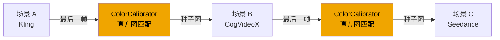

<div align="center">

# 🎬 Forge

**一个故事，多个 AI 模型，零手动拼接。**

[](https://github.com/F-R-L/forge-film/actions)
[](https://www.python.org)
[](LICENSE)
[](https://github.com/F-R-L/forge-film)

[English](README.md) | [快速开始](#-快速开始)

</div>

---

制作多场景 AI 影片，意味着要分别登录 Kling、CogVideoX、Seedance——手动下载帧、在不同模型之间校色、再手工拼接。一个 8 场景的短片，光是在各平台之间来回操作就能耗掉大半天。

**Forge 将整条流水线自动化。** 你只需写一个故事。Forge 将其编译为场景图，把每个场景路由到合适的模型，并行生成，保持跨模型的视觉连续性，最终输出一个 `final.mp4`。

---

## Forge 做什么

🧭 **故事 → DAG** — GPT-4o（或 Claude / DeepSeek）将故事编译为依赖图，无依赖关系的场景并行生成。

⚡ **CPM 并行调度** — 关键路径法找出最长依赖链并优先调度，N 个 worker 同时运行，而非逐一串行。

🎯 **场景类型路由** — 对话戏走 Kling，风景空镜走 CogVideoX（本地免费），动作戏走 Seedance。路由规则在 `forge.yaml` 中完全可配置。

🎨 **跨模型连续性** — 当场景 B（CogVideoX）紧随场景 A（Kling）时，Forge 自动提取 A 的最后一帧，进行直方图色彩匹配，并将其作为 i2v 种子图传给 B，消除突兀的色调跳变。

🎬 **流式拼接** — 场景完成一个拼接一个，归一化分辨率和帧率，输出 `final.mp4`。

---

## 端到端演示

给定故事（`examples/detective.txt`）：

```
一位疲惫的私家侦探接受了一个失踪案委托。他的客户是一位焦虑的中年女人，她的丈夫三天前离奇失踪。
侦探调查丈夫的办公室，发现一封未寄出的信和一张地下室的钥匙。
与此同时，一个神秘男人在街头跟踪侦探。
侦探找到地下室，发现了失踪丈夫藏匿的秘密账本。
神秘男人突然出现，两人发生冲突。
侦探最终将秘密账本交给警察，案件真相大白。
```

Forge 将其编译为 DAG 并调度：

```
forge plan examples/detective.txt --scenes 6

Plan: 6 scenes
DAG: {'S1': ['S2', 'S3'], 'S2': ['S4'], 'S3': ['S5'], 'S4': ['S6'], 'S5': ['S6'], 'S6': []}

Routing:
  S1  dialogue    → kling_light
  S2  action      → kling_heavy
  S3  landscape   → cogvideo
  S4  action      → kling_heavy
  S5  dialogue    → kling_light
  S6  dialogue    → kling_light

Critical path: S1 → S2 → S4 → S6  (最长链)
Estimated time: 20 min parallel  vs  30 min serial
```

然后执行生成：

```
forge run examples/detective.txt --workers 4

[00:00] S1 started  (kling_light)
[00:00] S3 started  (cogvideo)       ← 并行
[05:00] S1 done  → S2 unlocked
[05:00] S2 started  (kling_heavy)
[07:00] S3 done  → S3→S2 color calibration applied
[10:00] S2 done  → S4 unlocked
[10:00] S4 started  (kling_heavy)
...
[20:00] S6 done  → assembling final.mp4

Done. Output: ./output/final.mp4
```

---

## 并行调度

Forge 使用**关键路径法（CPM）**找出场景 DAG 中最长的依赖链，并优先调度这些场景。没有阻塞依赖的场景立即启动。

以上例为例：S1→S2→S4→S6 是关键路径。使用 4 个 worker 时，S1 和 S3 在 t=0 同时启动，总耗时从 30 分钟（串行）降至 20 分钟。

加速比随场景独立性而扩展——一个有一半场景可并行的故事，速度大约提升 2 倍。

```mermaid
gantt
    title 不用 Forge — 6 个场景 × 5 分钟 = 30 分钟
    dateFormat mm
    axisFormat %M min
    section 串行
    S1 :s1, 00, 5m
    S2 :s2, after s1, 5m
    S3 :s3, after s2, 5m
    S4 :s4, after s3, 5m
    S5 :s5, after s4, 5m
    S6 :s6, after s5, 5m
```

```mermaid
gantt
    title 使用 Forge（CPM）— 关键路径 = 15 分钟
    dateFormat mm
    axisFormat %M min
    section Worker 1
    S1 (Kling)     :s1, 00, 5m
    S3 (CogVideoX) :s3, after s1, 5m
    S5 (Seedance)  :s5, after s3, 5m
    section Worker 2
    S2 (Kling)     :s2, 00, 5m
    S4 (CogVideoX) :s4, after s2, 5m
    S6 (Seedance)  :s6, after s4, 5m
```





---

## 跨模型连续性

Kling、CogVideoX 和 Seedance 各有不同的色彩风格、曝光水平和视觉调性，直接拼接会产生明显的突兀感。

当场景 B 依赖场景 A 且两者使用不同后端时，Forge 自动执行：
1. 提取场景 A 的最后一帧
2. 进行直方图色彩匹配，对齐色彩分布
3. 将校正后的帧作为场景 B 的 i2v（图生视频）种子图

效果：跨模型边界实现视觉连续性，无需手动调色。



---

## 🚀 快速开始

```bash
pip install forge-film
cp forge.yaml.example forge.yaml  # 填入 API 密钥
forge run examples/detective.txt --workers 4
```

或者从源码安装：

```bash
git clone https://github.com/F-R-L/forge-film
cd forge-film
pip install -e .
forge run examples/detective.txt
```

**依赖项：**
- Python 3.11+
- ffmpeg（需在 PATH 中）
- 至少一个 API 密钥（OpenAI 用于编译；Kling / Seedance 用于视频生成），或使用 `mock` 后端做本地测试

---

## Python API

```python
from forge.config import ForgeConfig
from forge.compiler.vision_compiler import VisionCompiler
from forge.scheduler.scheduler import ForgeScheduler

cfg = ForgeConfig("forge.yaml")
compiler = VisionCompiler(cfg.build_llm_provider())
plan = await compiler.compile(story_text, num_scenes=6)

scheduler = ForgeScheduler(plan, generate_fn, num_workers=cfg.workers)
results, failed = await scheduler.run(asset_map, output_dir="./output")
```

---

## ⚙️ 配置

`forge.yaml` — 所有字段均为可选，缺省时回退到环境变量和默认值。

```yaml
llm:
  provider: openai      # openai | anthropic | deepseek
  model: gpt-4o

imagegen:
  provider: mock        # mock | openai | flux

routing:
  dialogue: kling_light     # Kling v1 — 口型同步 & 角色一致性
  action: kling_heavy       # Kling v1.5 Pro — 运动质量
  landscape: cogvideo       # CogVideoX 本地 — 免费
  default: mock

scheduler:
  workers: 4
```

```bash
# .env
OPENAI_API_KEY=sk-...
KLING_API_KEY=...
KLING_API_SECRET=...
```

| 配置项 | 可选值 | 默认值 |
|---|---|---|
| `llm.provider` | `openai` \| `anthropic` \| `deepseek` | `openai` |
| `imagegen.provider` | `openai` \| `flux` \| `mock` | `mock` |
| `validator.provider` | `openai` \| `anthropic` \| `mock` | `mock` |
| `routing.dialogue` | 任意后端名称 | `kling_light` |
| `routing.landscape` | 任意后端名称 | `cogvideo` |
| `scheduler.workers` | 整数 | `4` |

---

## 🆚 横向对比

| | Forge | OpusClip Agent | Seedance 多镜头 | FilmAgent |
|---|---|---|---|---|
| 开源 | ✅ MIT | ❌ 闭源 SaaS | ❌ | ✅ 学术原型 |
| 本地部署 | ✅ | ❌ | ❌ | 部分 |
| 多模型混用 | ✅ | ✅ 不可配置 | ❌ 单模型 | ❌ 3D 虚拟空间 |
| 跨模型色彩校准 | ✅ | 未知 | N/A | N/A |
| 可插拔后端 | ✅ | ❌ | ❌ | ❌ |
| 数据隐私 | ✅ 数据不出本地 | ❌ 经第三方 | ❌ | 部分 |

---

## 🎬 支持的视频后端

| 后端 | 接入方式 | 适合场景 | 费用 |
|---|---|---|---|
| `kling_light` | API（Kling v1） | 对话、特写、角色一致性 | 按秒计费 |
| `kling_heavy` | API（Kling v1.5 Pro） | 动作、复杂运动、长片段 | 按秒计费（较高） |
| `cogvideo` | 本地（CogVideoX-2b） | 风景、过渡、氛围镜头 | 免费（需 GPU） |
| `seedance` | API（Seedance） | 快速运动、体育、动态场景 | 按秒计费 |
| `wan` | 本地（Wan 2.x） | 通用，性价比高 | 免费（需 GPU） |
| `mock` | 本地（空操作） | 测试、CI、开发调试 | 免费 |

所有后端实现相同的 `BasePipeline` 接口——新增一个后端只需约 50 行代码。

---

## ❓ 常见问题

**需要 GPU 吗？**
不需要。所有云端后端（Kling、Seedance）均基于 API。只有使用本地的 CogVideoX 或 Wan 后端时才需要 GPU。

**能只用一个视频模型吗？**
可以。在 `forge.yaml` 中将所有路由键设置为同一后端，或在 CLI 中传入 `--backend kling_light`。

**API 调用失败怎么处理？**
每个场景最多重试 `scheduler.max_retries` 次（默认 2 次），采用指数退避。失败的场景会在 `failed` 字典中返回，方便查看或重新运行。

**拼接器输出什么格式？**
默认通过 ffmpeg 输出 H.264 MP4。拼接前会对所有输入片段的分辨率和帧率进行归一化。

**能接入自己的视频模型吗？**
可以——继承 `forge/generation/base.py` 中的 `BasePipeline`，实现 `generate()` 方法，并在路由器中注册。其他地方无需改动。

---

## 🏗️ 架构

```
ForgeConfig (forge.yaml)
└── VisionCompiler    故事 → ProductionPlan (scenes + assets + DAG)
    └── DAGValidator  拓扑检查 + 自动修复
        └── ForgeScheduler   CPM 优先级 · N workers · 重试机制
            ├── PipelineRouter    scene_type → kling / cogvideo / seedance
            └── ColorCalibrator   最后一帧直方图匹配用于 i2v
    ├── VLM Validator    可选帧一致性检查
    └── StreamAssembler  ffmpeg 拼接 → final.mp4
```

---

## 📁 项目结构

```
forge/
  compiler/      # 故事 → DAG（LLM 驱动）
  providers/     # LLM / ImageGen / VLM 抽象层
  scheduler/     # DAG 拓扑 + CPM 调度
  generation/    # 视频后端 pipeline
  continuity/    # 跨模型色彩校准
  assets/        # 参考图像生成与缓存
  validation/    # VLM 帧一致性检查
  assembler/     # 流式视频拼接
  cli.py
  webui/
forge.yaml
examples/
tests/         # 20 个测试，无需 API key
benchmarks/
```

---

## 🗺️ Roadmap

- [x] 按场景类型的多模型语义路由
- [x] 跨模型色彩校准（直方图匹配）
- [x] 可插拔 LLM / ImageGen / VLM 提供商
- [x] 基于后端感知时长的 CPM 调度
- [x] forge.yaml 统一配置
- [x] Gradio Web UI
- [x] CogVideoX 本地后端
- [ ] Seedance 后端
- [ ] Wan 2.x 后端
- [ ] GPU 加速本地视频拼接
- [ ] 故事模板库
- [ ] 使用 Kling API 的真实 benchmark 结果

---

## 🤝 贡献

欢迎 PR 和 Issue — 详见 [CONTRIBUTING.md](CONTRIBUTING.md)。

---

## 📄 许可证

MIT — 详见 [LICENSE](LICENSE)
